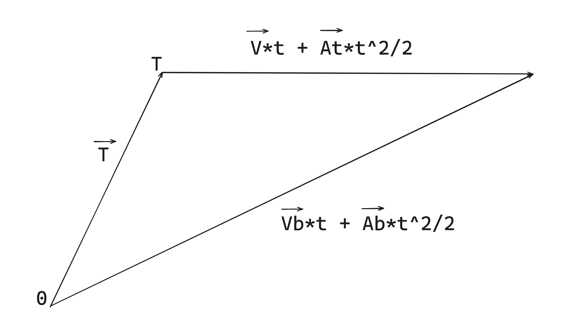

# Shot prediction demo godot
Implementation of bullet hit prediction formulas for a moving target considering accelerations. \
And also Implementation of a function to solve the quartic equation.

## Formula
**Vb = T / t + V + A * t / 2** *where:* \
**Vb** *- the desired bullet motion vector* \
**T** *- vector to target* \
**V** *- target motion vector \
**A** *- is the difference between the acceleration vectors of the bullet and the target* \
**t*** - is the minimum positive root of this equation:* **(A * A) / 4 * t^4 + (A * V) * t^3 + (V * V + A * T - s^2) * t^2 + 2 * (V * T) * t + T*T = 0** *where:* \
**s** *- is the speed of the bullet*

## Proof formula

# Given:
**T** *- vector to target* \
**V** *- target motion vector* \
**At** *- target acceleration vector* \
**Ab** *- bullet acceleration vector* \
**s** *- bullet speed*\
**s = |Vb|**\
**A = At - Ab**

**Vb** *- the desired bullet motion vector*

# Solution:
**Vb * t + Ab * t^2 / 2 = T + V * t + At * t^2 / 2** \
**(Vb + Ab * t/2) * t = T + (V + At * t/2) * t** \
**Vb = T / t + V + (At - Ab) * t/2**

**Vb = T / t + V + A * t/2** \
**Vb * t = A * t^2 / 2 + V * t + T**

**{ Vb.x * t = A.x * t^2 / 2 + V.x * t + T.x** \
**{ Vb.y * t = A.y * t^2 / 2 + V.y * t + T.y** \
**{ Vb.z * t = A.z * t^2 / 2 + V.z * t + T.z**

**|Vb|^2 = s^2** \
**|Vb|^2 - s^2 = 0** \
**Vb.x^2 + Vb.y^2 + Vb.z^2 - s^2 = 0**

**{ (Vb.x * t)^2 + (Vb.y * t)^2 + (Vb.z * t)^2 - s^2 * t^2 = 0**
***
**(A.x / 2 * t^2 + V.x * t + T.x)^2 + (A.y / 2 * t^2 + V.y * t + T.y)^2 + (A.z / 2 * t^2 + V.z * t + T.z)^2 - s^2 * t^2 = 0**

*( (A.x / 2 * t^2 + V.x * t + T.x)^2 = A.x^2 / 4 * t^4 + V.x^2 * t^2 + T.x^2 + A.x * V.x * t^3 + 2V.x * T.x * t + A.x * T.x * t^2 )* \
*( = A.x^2/ 4 * t^4 + A.x * V.x * t^3 + (V.x^2 + A.x * T.x) * t^2 + 2 * V.x * T.x * t + T.x^2 )*

**A.x^2 / 4 * t^4 + A.x * V.x * t^3 + (V.x^2 + A.x * T.x) * t^2 + 2 * V.x * T.x * t + T.x^2  +  A.y^2 / 4 * t^4 + A.y * V.y * t^3 + (V.y^2+A.y * T.y) * t^2 + 2 * V.y * T.y * t + T.y^2  +  A.z^2 / 4 * t^4 + A.z * V.z * t^3 + (V.z^2 + A.z * T.z) * t^2 + 2 * V.z * T.z * t + T.z^2  -  s^2 * t^2 = 0** \
**(A.x^2 + A.y^2 + A.z^2) / 4 * t^4 + (A.x * V.x + A.y * V.y + A.z * V.z) * t^3 + (V.x^2 + V.y^2 + V.z^2 + A.x * T.x + A.y * T.y + A.z * T.z - s^2) * t^2 + 2 * (V.x * T.x + V.y * T.y+V.z * T.z) * t + (T.x^2 + T.y^2 + T.z^2) = 0**
 
**(A * A) / 4 * t^4 + (A * V) * t^3 + (V * V + A * T - s^2) * t^2 + 2 * (V * T) * t + T*T = 0**
